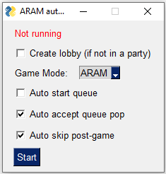
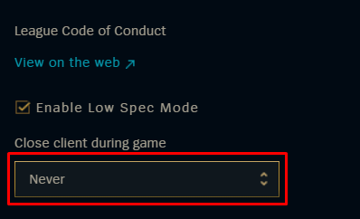

# AutoQr  

!! Please ensure to disable closing client in background for best performance / compatibility !!

The purpose of this program is to streamline the flow between games. You'll no longer have to wait for buggy or unresponsive parts of the client to load as this script will programatically skip them.

This program takes the following actions:

1. Create a lobby
1. Start queue
1. Wait for champion selection and the game to end...
1. Honor a random player in post-game
1. Hit play again
1. Repeat!

## Requirements

- Python3

## Setup (running from source)

1. Install [python](https://www.python.org/downloads/)
1. Install dependencies
    `pip install -r src/requirements.txt`

## Build

See [Build.md](docs/build.md)

## Usage

1. Login to league of legends
1. `python3 src/main.py`

## Releases

https://github.com/SaffatHasan/AutoQr/releases

Note: I don't know how to sign executables. You may get a warning. Please be careful when running arbitrary executable files from the internet.

## Reference

- LCU documentation https://lcu.vivide.re/
- LCU utilities https://riot-api-libraries.readthedocs.io/en/latest/lcu.html

## Credits

This project is heavily inspired from [directx's auto-lock script](https://github.com/directx5/League-of-Legends-Auto-Accept-Insta-Lock-Python).
